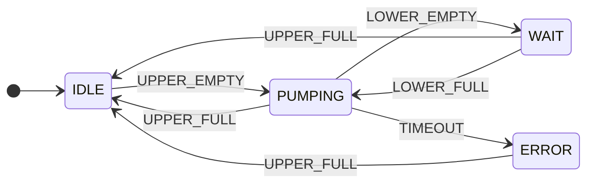

# BombaESPHome

```mermaid
stateDiagram-v2
  direction LR
  [*] --> IDLE
  IDLE --> PUMPING: UPPER_EMPTY
  PUMPING --> IDLE: UPPER_FULL
  WAIT --> IDLE: UPPER_FULL
  ERROR --> IDLE: UPPER_FULL
  PUMPING --> WAIT: LOWER_EMPTY
  WAIT --> PUMPING: LOWER_FULL
  PUMPING --> ERROR: TIMEOUT
```
